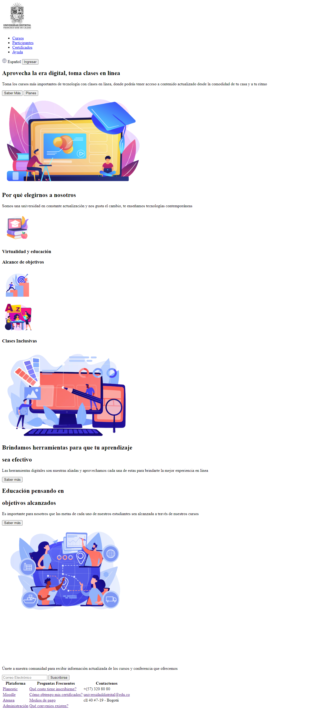
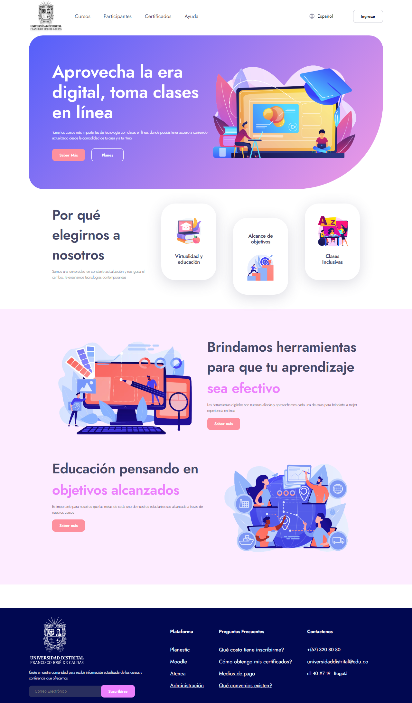
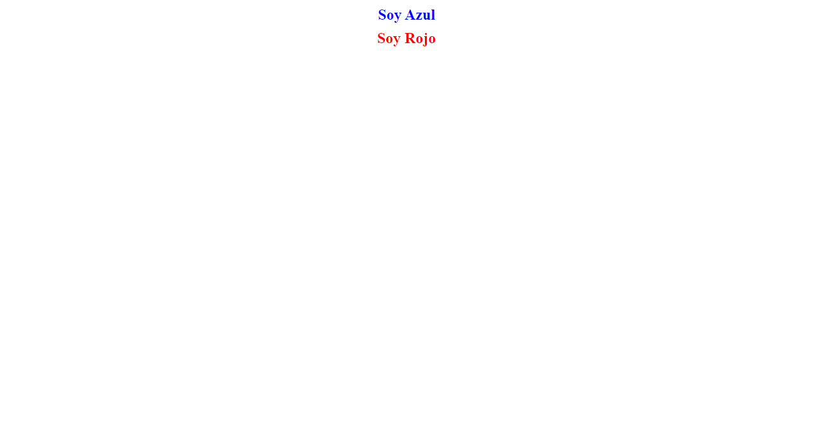
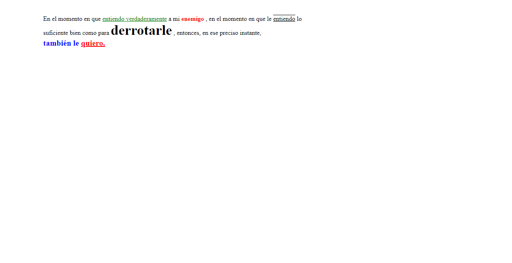
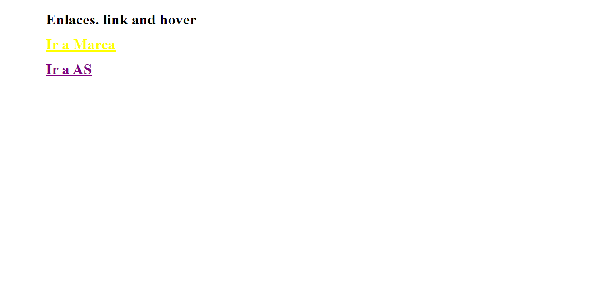
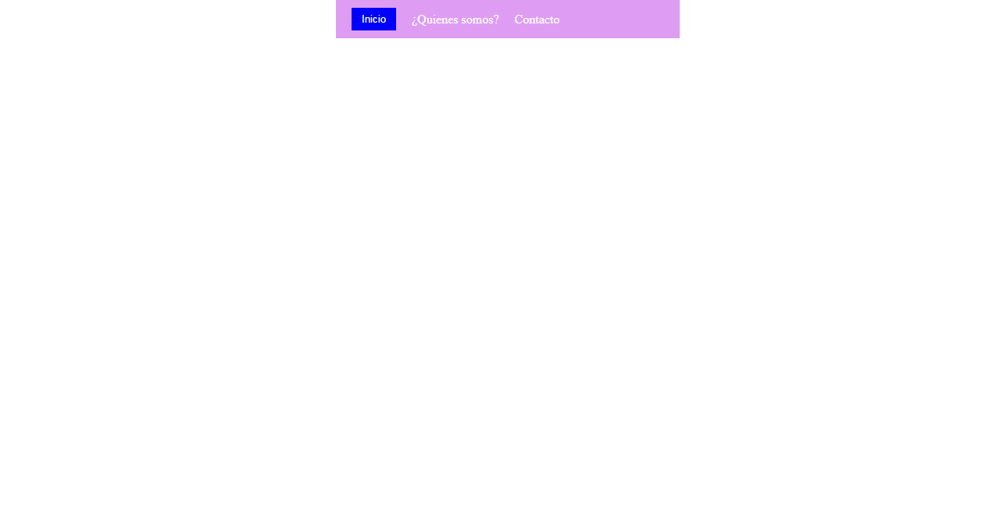
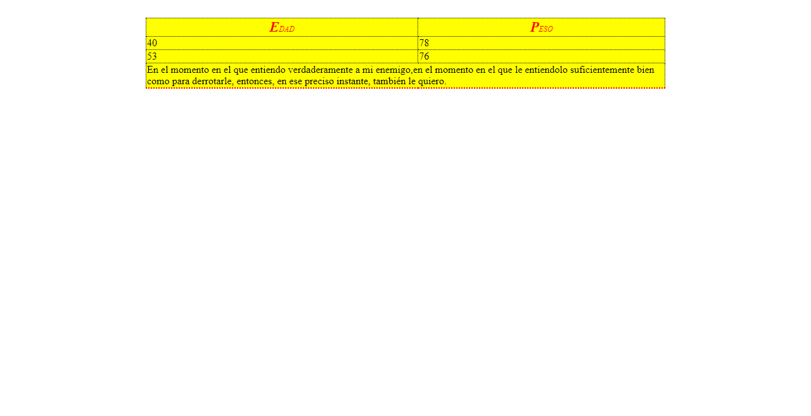
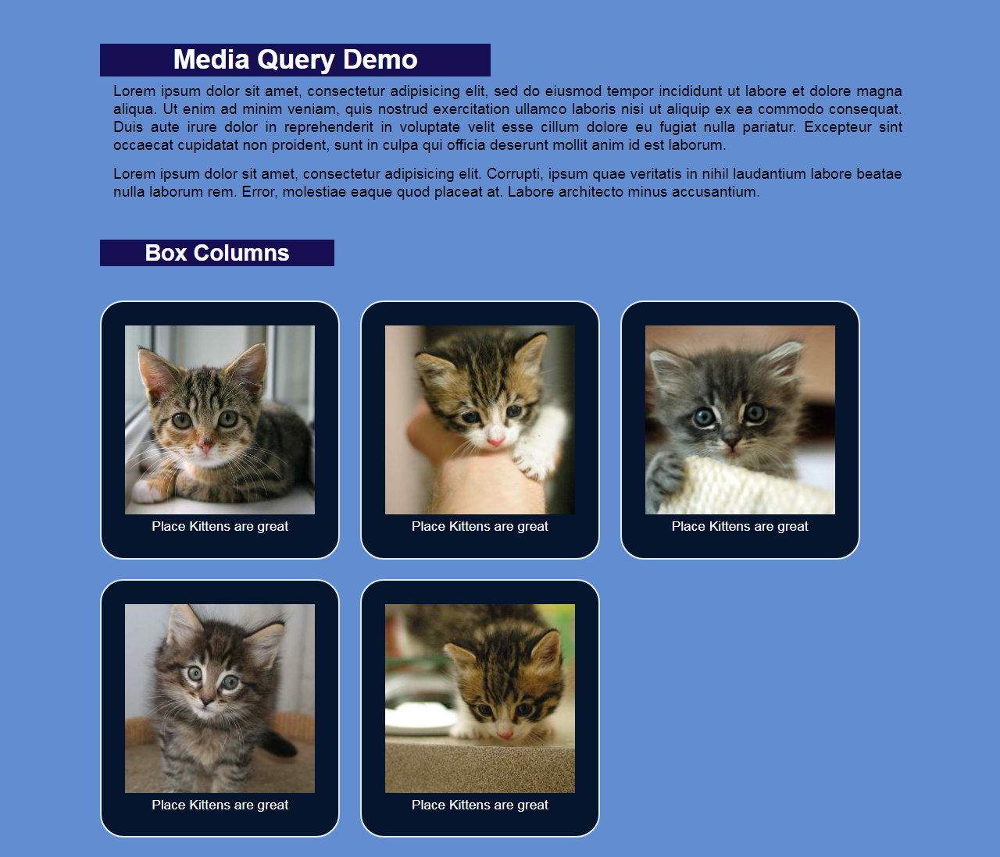

<h1>Taller 9: Karol Cordero</h1>

<h2>Información</h2>

Curso: Full Stack Básico - Grupo 1

Profesor: Cristian Patiño

<h2>Punto 1: Mockup en figma</h2>
<a href="https://www.figma.com/file/KmA6zgjmOJraQbq1yqLXAY/Excercise-1?node-id=30%3A274&t=gumKv8DdLFV4ZLFa-1">Link de diseño en figma</a>

<a href="#">Link pagina</a>
 

<h2>Punto 2: HTML</h2>

<h2>Punto 3: CSS</h2>

<h2>Punto 4: Textos de diferentes colores </h2>

<h2>Punto 5: Textos con diferentes estilos y colores</h2>

<h2>Punto 6: Enlaces con colores</h2>

<h2>Punto 7-8: Barra de navegación</h2>

<h2>Punto 9: Tabla </h2>

<h2>Punto 10: Página responsive design </h2>
